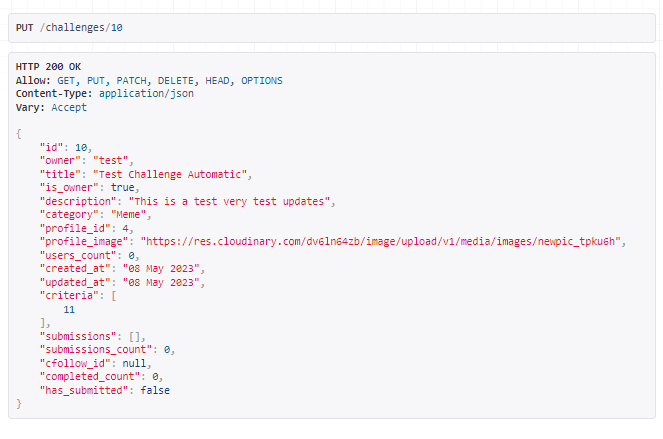
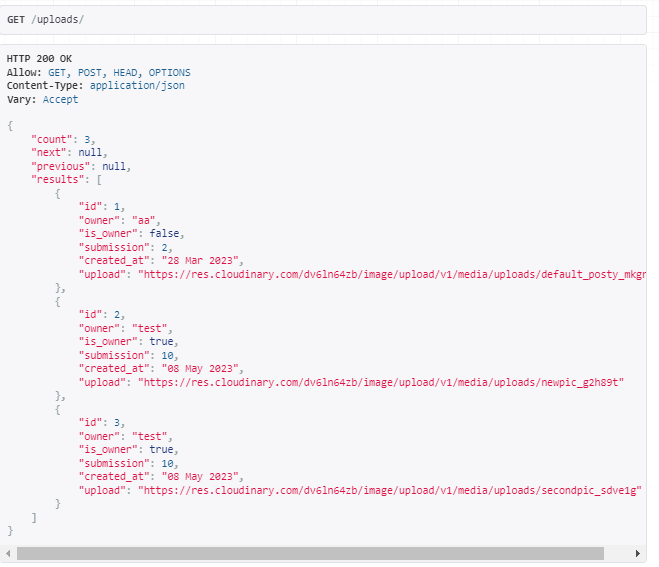

# DARESHARE API (Previously Challengeshare API)

This documents purpouse is to detail the datastructure and testing of the DARESHARE API.
DARESHARE API is the backend for the DARE/SHARE Social Platform. A community driven platform for challenges (or dares as it is less of a mouthful). Users create the dares, submit their proof of completeing them and the public reviews the proof and decides if they pass or not.

## Deployed project
[Link to deployed API](https://challenge-apimk3.herokuapp.com/) 

## Repository

[Link to Github Repository](https://github.com/FRNBDN/challengeshare-api)

## Project Approach
This application was built with the help of a Database Diagram which will be displayed a bit further down. I decided against UserStories for the database as they would be very repetetive.

## Project Planning
The project as I mentioned above was planned out using a database diagram, Lucidchart, after first deciding on what the application should be used for, and what core features should be there, I put that into the diagram to get a better sense of how to configure the models.

# Data model & CRUD breakdown

* As you can see the name was switched a bit, here it was ChallengShare.

*Ill be refering to the models as they are named in the API but when we first encounter them in the text I will let you know what they are called on the frontend.
## The Challenge Model (Dare on the fronted)
- owner = a ForeignKey to the User model. It creates a relation between a User and a Challenge.
- created_at = is an automatically added DateTime instance when the challenge is created.
- updated_at = is an automatically added DateTime instance when the challenge is updated.
- title = A CharField instance, the Title of the challenge.
- description = A TextField instance describing the challenge in text.
- category = a CharField instance that has a list of choices that best categorizes the challenge:
    - Spread Positivity
    - Fitness
    - Adventure
    - Creativity
    - Social
    - Meme

## The Criterion Model
- owner = This is a ForeignKey to the User model. It creates a relation between a User and a Criterion.
- challenge = This is a ForeignKey to the Challenge model. It creates a relation between a Criterion and a Challenge.
- created_at = is an automatically added DateTime instance when the criterion is created.
- updated_at = is an automatically added DateTime instance when the criterion is updated.
- text = A TextField that describes a criteria for a challenge so the owner of a challenge can explain out the rules of their challenge better.

## The Submission Model
- owner =  a ForeignKey to the User model. It creates a relation between a User and a Submission.
- created_at = an automatically added DateTime instance when the submission is created.
- updated_at = an automatically added DateTime instance when the submission is updated.
- challenge = a ForeignKey to the Challenge model. It creates a relation between a Challenge and a Submission.
- text = A textfield where the submission and its uploaded images gets explained with extra context by the owner.
- status = A charfield which accepts the choices of Submitted, Completed and Passed, it is set programmatically in the serializers

## The Upload Model
- owner = a ForeignKey to the User model. It creates a relation between a User and a upload.
- submission =  a ForeignKey to the Submission model. It creates a relation between a Upload and a Submission.
- created_at =  an automatically added DateTime instance when the upload is created.
- upload =  a ImageField that accepts one image file.

## The Profiles Model
- owner =  a ForeignKey to the User model. It creates a relation between a User and a Profile.
- created_at = is an automatically added DateTime instance when the Profile is created.
- updated_at = is an automatically added DateTime instance when the Profile is updated.
- bio = is a textfield that will be displayed on the users profile, a short introduction.
- image = is an ImageField so that an user can upload a picture of themself or anothe avatar, with a default fallback.

*The profile model creates a django user model using post_save

## The Review Model
- owner =  a ForeignKey to the User model. It creates a relation between a User and a Review.
- submission =  a ForeignKey to the Submission model. It creates a relation between a Submission and a Review.
- created_at = an automatically added DateTime instance when the Review is created.
- updated_at = an automatically added DateTime instance when the Review is updated.
- body = a TextField where the user can write the users thoughts and reasoning as why the user voted to pass/fail the submission
- vote_pass = a BooleanField, for the user to decide if they vote for the submisison to pass, or fail.

## The ChallengeFollower Model (Bookmarked on the fronted)
- owner = a ForeignKey to the User model. It creates a relation between a User and a ChallengeFollower.
- challenge = a ForeignKey to the Challenge model. The challenged that is being followed.
- created_at =  an automatically added DateTime instance when the ChallengeFollower is created.

## The UserFollower Model (Follow on the frontend)
- owner = a ForeignKey to the User model. It creates a relation between a User and a UserFollower.
- followed = a ForeignKey to the user model. The user that is being followed.
- created_at =  an automatically added DateTime instance when the UserFollower is created.

## CRUD breakdown
| model     | endpoints                    | create        | retrieve | update | delete | filter                                        | text search |
| --------- | ---------------------------- | ------------- | -------- | ------ | ------ | ------------------------ | ----------- |
| challenges     | challenges/ challenges/:id/ | yes    | yes      | yes    | yes    | followed users owner followed challenges | owner   title   description   category       |
| criteria     | criteria/ criteria/:id/ | yes           | yes      | yes    | yes    | challenge                                        | no       |
| submissions     | submissions/ submissions/:id/ | yes   | yes      | yes    | yes     |followed users owner followed submissions    | owner   text          |
| uploads  | uploads/ uploads/:id/        | yes  |        yes      | yes    | yes     | submission                                       | no        |
| profiles     | profiles/ profiles/:id/   | yes        | yes      | yes     | no     | following   followed                        | no          |
| reviews  | reviews/ reviews/:id/          | yes        | yes      | yes    | yes    | submisssion                                        | no          |
| challengefollowers | cfollowers/ cfollowers/:id/| yes   | yes      | no     | yes    | no                                                | no          |
| userfollowers |ufollowers/ cfollowers/:id/| yes         | yes      | no     | yes    | following   followed                       | no          |

# Technology used
## Languages used
- [Python](https://en.wikipedia.org/wiki/Python_(programming_language))

## Frameworks & Libraries used
- [Django](https://www.djangoproject.com/)
  - This website is built using Django, a high-level Python web framework. 
  - [Django Allauth](https://django-allauth.readthedocs.io/en/latest/index.html) I used Allauth for user authentification, User Model.

## Other
- [ElephantSQL](https://www.elephantsql.com/) - used to manage a PostgreSQL database.
- [Lucidchart](https://www.lucidchart.com/pages/) used to make a database diagram.
- [Cloudinary](https://cloudinary.com/) -  for hosting the uplaoded images and the user avatars

# Testing

## Manual Tests

Below is a series of manual tests that tests the basic crud functionality of all the models through expected useage of the models, the tests were carried out in the api view on a locally run database, the database is however the same as production.

## Profile Test Case

The profile testcase tests the user model through Creating a user, see the profile being made, update profile as the user cant be deleted, just updated.

### Create Profile 

Start with creating a user from from the '/dj-rest-auth/registration/' simulating creating a user from the frontend.

### List View

List of profiles, including the recently added one on top

### Update Profile Information

Updating the profile by changing the bio and the upload

Success, all of the responses were what was expected and all the information was updated appropriately.

## Challenge & Criteria Test Case

The Challenge testcase includes criteria, because the criteria will be made in the same form as the challenge, so in the real application they are very much linked.

We will first create a challenge and criteria, update them and delete them testing their validations and the cascading effect, make sure everything goes as planned.

## Create Challenge and then Criteria

Screenshot showing the challenge creation and the data in the payload

Creating criterion (The data is shown in the list view below, poor screenshotting by me):

criterion being posted on a not owned challenge

### List View of Challenge, Criteria

List view of challenges:

List view of criteria:

### Update Challenge, Criteria

Challenge update:

The fields were updated as expected, note that there is a criteria with id 11 here

criterion update:

The fields were updated as expected

### Delete Criteria, Challenge, Test Cascade

For the deletion of criteria and challenges, I will start with trying to delete a criterion, then the challenge, which has an extra criteria added as mentioned next to the challenge update, to see that the cascade works

criterion delete:

challenge delete:

the criteria with id of 10 and 11 is not in the list as expected

Success, everything is working as expected

## Submissions, Uploads & Reviews Test Case

The submission testcase is very much like the challenge one, but this time there is two extra models caked in, since the submission model has uploads by the user and reviews from other users.

### Create Submission and then Uploads 

First we create a submission, like the challenges and criteria, the uploads are tied to the submission model by always being created or updated together.
 

The payload matches the created submission

When the user tries to submit another submission to the same dare...

They get this error message

Creating uploads to own submission, id 2:

Creating second upload to own submission, id 3:

Creating upload to not owned submission:

So users can create uploads to their own submissions, but not others submissions, and they are not unique together.

### Create Review, Test Unique Together Constraint

Now lets try reviewing another users submission, review id 4:

Try reviewing my own submission:

And finally a second review to another users submission

### List View of Submission, Uploads, Reviews

Next is testing that the list view is showing all the fields. 

Submission list (created submission= id 10):

Uploads List id 2, 3: 

Review List id 4:

While testing this I noticed that I was allowed to review my own submission, as you can see with id 5 in the list, but as you saw above, that has been fixed

### Update Submission, Upload, Review

Testing updating the models with .put, changing the payload as shown in the pictures:

Submission updating text

updating text successfully

Upload updating the file

Changed the picture from firstpic to newpic successfully

Review updating body, vote_pass

Changed the body as shown in picture, vote_pass from true>false, sucess

### Delete Submission, Upload, Review, Test Cascade

Now testing that the deletion works as expected

Upload Deletion:

deletes the upload successfully

review deletion:

deletes the review successfully

submission deletion:

deletes the submission successfully

The reviews list above had id 5 and 4 by user test and we deleted id 4 two picturess up:

the review list after deletion of submission shows that even id 5 was deleted, confirming that the cascade works as expected

## ChallengeFollow Test Case
The challengefollow model test case is testing the creation and deletion and the fields in the view

### Create ChallengeFollow

Creating a ChallengeFollow, in the frontend this would be following(bookmarking) a challenge(dare):

the ChallengeFollow instance is created with the corrent ForeignKeys

the ChallengeFollow instance is not able to be created more than once, since you cant bookmark the post twice

the ChallengeFollow instance is not created as the user not allowed to follow their own challenges

### List View

Note the first one with id of 9 and challenge 11, the post got deleted

And here is the result after the post was deleted, it was sucessfully cascaded

### Test Delete

the challengefollow is successfully deleted the cfollowers id 8

## UserFollow Test Case

The userfollow model test case is testing the creation and deletion and the fields in the view

### Create  UserFollow

Creating a UserFollow, in the frontend this would be following a user:

Successfully follow the user

doesnt allow following a user twice

doesnt allow following yourself

### List View

created userfollow is in the list

### Test Delete

Deletes successfully

Each model (profiles, comments, followers, recipes, ingredients, likes) is tested and a test report including screenshot can be found in each respective user story on Github. 
To give the reader an overview, the following tests were done:
- [Test to see a list of profiles, the automatic creation of a profile, and the update of profile data (name, image, bio)](https://github.com/MerelMoehn/cheffies-api/issues/3#issuecomment-1468016700)
- [Test to see a list of followers, creating a follower, validating the validation for duplicates, and see the follower count & id in profiles](https://github.com/MerelMoehn/cheffies-api/issues/4#issuecomment-1468024320)
- [Test to see a list of likes, create like, validate the validation on likes, and check the like_count and ID at /recipes](https://github.com/MerelMoehn/cheffies-api/issues/5#issuecomment-1468029198)
- [Test to see a list of comments, create comment, and check the comment_count at /recipes](https://github.com/MerelMoehn/cheffies-api/issues/6#issuecomment-1468048723)
- [Test to see a list of recipes, create recipe, and update a recipe](https://github.com/MerelMoehn/cheffies-api/issues/7#issuecomment-1468059442)
- [Test to see a list of ingredients, create ingredient, try to create a duplicate ingredient, and update a ingredient](https://github.com/MerelMoehn/cheffies-api/issues/8#issuecomment-1468069887)

## Validators
All python code has been run through the python validator without issues.

## Automated testing
In total there are 65 automated tests built to test the views of each app.
I created tests for all of the basic functions of all the models in the database, testing the crud capabilities. 

## Bugs found and solved
Throughout the project there were a couple of small bugs that were found and easily fixed, mostly due to missing commas, poor indentation etc, but they were all easily sovled except for a bug with Django-Taggit.

## Unsolved bugs
I would consider Django-taggit a honorable mention as it was scrapped so it is not apart of the project anymore, which means its not an unsolved bug!

#### Bug description
But the taggit taggable manager is supposed to effortlessly create tags for your models, easily ingested by essentially a textfield that then splits up by comma into an array. It worked fine in the admin client, but in tests and in the fronted app and in the DRF Default API View i didn't have as much fortune.

#### Debug Process to surrender
I first made sure that I configured everythign right, and I found that the Default API view wasn't working at all, so I started checking around for help and when i realized moste people are using it in their Django apps and not in DRF API I went to their documentation for answers, the serializers configurations they mentioned worked for the API View, as in when i put in data, it saved, but once i refreshed the page, it disappeard again.

Since it didnt work there, or in tests or frontend, and all the posts online were about using it in django Views/Admin and not for serializers and DRF, I decided to leave it to the end of development and if there is time, then I would work more on it, but ultimately decided to drop taggit from the project.

## Security Features and Defensive Design

### User authentication
- User authentication is the standard django allauth User Model

### Database Security
The steps taken are as follows:
- Every put/create request requires authentication and users are checked for the apropriate permission before allowing it.
- All secret keys are stored in a separate env.py file that is only kept locally and in config variables on the hosting platform, never published.

## Deployment
The application is deployed on Heroku with the database being hosted on ElephantSQL.

### Production Deployment
The deployment consists of creating and linking up the heroku app and connecting it to the ElephantSQL Database. 

After creating and finishing my drf api app I deployed the project to Heroku.

#### Create Heroku app:
1. Log in to Heroku.
2. Create the app in the dashboard by clicking "New" and "Create new app" in the dropdown
3. Name the app, choose the region closes to you and click create app.

#### Create a image hosting platform with Cloudinary:
1. Create a cloudinary account.
2. Copy the API environment password to use as a config variable down below

#### Create ElephantSQL Database:
1. Log in to ElephantSQL.
2. Create the database isntance in the dashboard by clicking "Create new instace"
3. Name the app, choose the plan and click choose region.
4. Choose region, closes to you, click review.
5. Click Create instance.
6. Navigate to the detaisl apge database you created
7. Copy the value of the URL column, (postgres://.....) to use as a config variable down below

#### Connect ElephantSQL Database to Heroku App:
1. Open the your on the Heroku Dashboard
2. Navigate to the Settings tab and go to config vars, reveal them
4. Add Config Vars Key: DATABASE_URL Value: URL from elephantSQL

#### Deploy App on Heroku:
1. Go to Settings > Config Vars > Reveal Config Vars
2. Add a SECRET_KEY Variable
3. Add the CLOUDINARY_URL Variable from the cloudinary account dashboard
4. Add the EMAIL_HOST_PASSWORD Variable from the gmail app password
5. Under Deployment method select github and choose the correct repository.
6. Scroll down to Deploy and deploy the project.

## Creating a local clone
You can create a local clone of the repository via the following steps:
1. navigate to the main page of the repository
2. download the code
3. Copy the URL for the repository.
4. Open Terminal
5. Change the current working directory to the location where you want the cloned directory.
6. Type git clone, and then paste the URL you copied earlier.
7. Press Enter to create your local clone.

For more detailed instructions, navigate to the following page:
https://docs.github.com/en/repositories/creating-and-managing-repositories/cloning-a-repository

# Credits
## Code

### Code Resources

Code Institute DRF API Project  - Walkthrough

